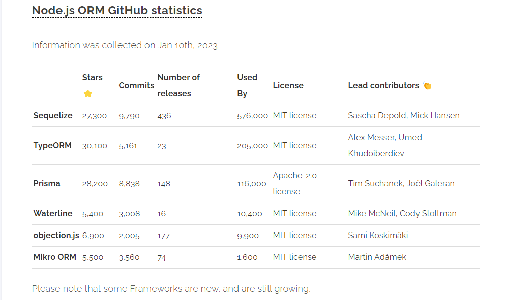

# sample-node-rest-api
Create a sample node js app with swagger UI, for learn node js as a begginer.

What is Node JS?

Installation-

Create new app/Setup New app-
- mkdir 'folder_name'
- cd 'folder_name'
- nm init -y

- npm install express mysql2 sequelize swagger-ui-express dotenv
'create a new node project with mysql DB and swagger UI'

Create a project structure like this.
- src
  - models
    - user.js
  - routes
    - users.js
  - index.js
  - db.js
- swagger
  - swagger.json
- .env

In the NodeJS many ORM(Object Relational Mapper) available. See the following Image.
  -
  - We are use the Sequelize ORM in our application.

-How does ORM work.